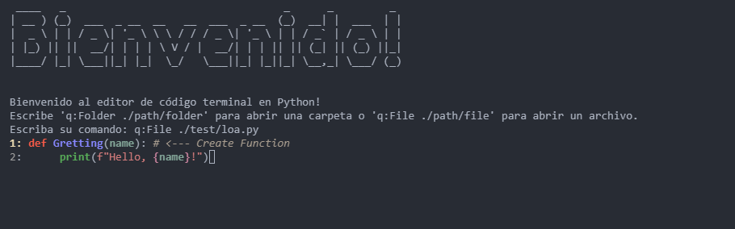

# PureEdit
Welcome to **PureEdit** – a sophisticated, lightweight **terminal-based** code editor designed to provide a seamless and enjoyable coding experience. With PureEdit, you can easily navigate directories, create, edit, and manage files with a sleek and intuitive interface.

## Features
- Folder and File Navigation: Effortlessly browse through directories and manage files.

- Syntax Highlighting: Automatically detects file extensions and applies the appropriate syntax highlighting.

- File Management: Create new files, delete existing ones, and organize your projects with ease.

- Tab Management: Switch between multiple open files using tabs.

- Customizable Interface: Personalize your coding environment with custom fonts and styles.

- Keyboard Shortcuts: Enhance your productivity with intuitive keyboard shortcuts.

- Installation
To get started with PureEdit, follow these simple steps:

## Key Binds
Ctrl + S: Save the current file.

Ctrl + Q: Switch between open tabs.

Ctrl + B: Browse files and folders.

Escape: Exit the editor.

## Contributing
We welcome contributions from the community! If you'd like to contribute to PureEdit, please follow these steps:

Fork the repository: Click the "Fork" button at the top right corner of this page to create a copy of the repository in your GitHub account.

Clone the repository:

``bash
git clone https://github.com/NopAngel/pure_edit.git
cd pure_edit
``
Create a new branch:

``bash
git checkout -b feature/your-feature-name
``
Make your changes and commit them:
``bash
git commit -m "Add your feature"
``
Push to the branch:
``bash
git push origin feature/your-feature-name
``
Create a pull request: Open a pull request in the original repository, describing the changes you've made and why they should be merged.

## License
This project is licensed under the <a href="/LICENSE">MIT License.</a>

## Acknowledgements
Thank you for using PureEdit! We hope it enhances your coding experience. If you have any questions or need assistance, please don't hesitate to reach out.